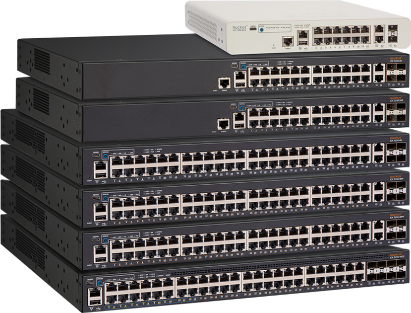
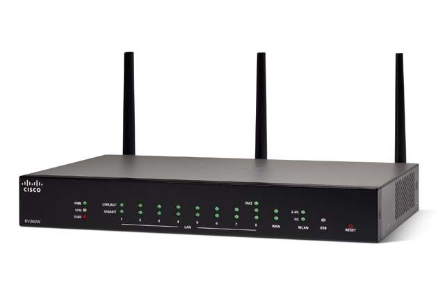

# Essentials for Containers | docker | nomad | k8s | k3s | simplenetes

## Networking

### Network OSI Model

- The Open Systems Interconnection model is a conceptual model that describes the universal standard of communication functions of a telecommunication system or computing system, without any regard to the system's underlying internal technology and specific protocol suites. 

| Layers | Physical | Datalink | Network | Transport | Session | Presentation | Application |
| -------| -------- | -------- | ------- | --------- | ------- | ------------ | ----------- |
| Protocol Data Unit[PDU] | Bit | Frame | Packet | Segment/Datagram | Data | Data | Data |
| Notes | Physical Connection Between Devices | This layer is the protocol layer that transfers data between nodes on a network segment across the physical layer | Addressing routing and delivery of datagrams between point to point networks | reliable delivery of segments between points on a network | interhost communication , managing session between applications.It provides services such as connection-oriented communication, reliability, flow control, and multiplexing. | Data representation , encryption decryption, converting machine dependent data to machine independent data | Network processes to the applications like web applications , Emails, Messengers |
| Device | Eithernet PHY,Hubs, Repeaters, Cables, Fibers, Wireless | Bridges, Modems, Network cards, 2-layer switches | Routers, Brouters, 3-layer switches | Gateways, Firewalls | Gateways, Firewalls, PC’s | Gateways, Firewalls, PC's | Gateways,Firewalls, all end devices like PC’s, Phones, Servers |
| Communication | Electrons(Signals On-Off) | Frames are sent to a specific switch port based on destination MAC addresses | packets are sent to a specific next-hop IP address, based on destination IP address | Reliable Communication on IP:Ports | Data communication on IPs and Ports on IPs and Ports on Protocals like TCP,UDP,HTTP| Data Communication on IPs and Ports on Protocals like TCP,UDP,HTTP | Data Communication on IPs and Ports on Protocals like TCP,UDP,HTTP |
| Services | The physical layer performs bit-by-bit or symbol-by-symbol data delivery over a physical transmission medium | -Encapsulation of network layer data packets into frames -Physical addressing (MAC addressing) -Error Control (Automatic Repeat Request) - LAN switching (packet switching), including MAC filtering, Spanning Tree Protocol (STP), Shortest Path Bridging (SPB) and TRILL (TRansparent Interconnection of Lots of Links) - Data packet queuing or scheduling | Connectionless communication from source to destination via one or more networks | - Connection oriented communication as a data stream . - Order or delivery . - Reliability . - Flow Control . - Multiplexing: Ports can provide multiple end points on a single node. | - Session checkoint of recovery. - Authentication. - Authorization. | - Data conversion. - Charcode translation . - Compression . - Encryption-Decryption . - Serialization | - Process-Process Communication. - RESTFul Communication - gPRC,SMTP Communication via applications, Client-Server , Peer-Peer networking model implementations |

### Network devices

#### switch

- Switches are very important to form a network.They can connect multiple devices such as computers, printers , wireless access points and servers which are in same building or in the campus.
- Switches comes with ports,firmware or OS.
- Unmanaged switches: Simple switches with no or fewer configuration options. Generally used in homes and small businesses.
- Managed switches: Manged switches gives more configuration options, grater security more features with greater control. In general managed switches comes with software so that most of the configurations can be done through software.Users can access switch through CLI or GUI based interfaces.

  
##### l2 switch

- A Layer 2 switch works with MAC addresses only and does not care about IP address or any items of higher layers

##### l3 switch

- Layer 3 switch, or multilayer switch, can do all the job of a layer 2 switch and additional static routing and dynamic routing as well. That means, a Layer 3 switch has both MAC address table and IP routing table, and handles intra-VLAN communication and packets routing between different VLANs. 
- If you need the switch to aggregate multiple access switches and do inter-VLAN routing, then a Layer 3 switch is needed

##### cloud managed networking

- Enter cloud-managed networking solutions comprising of wireless access points, switches, security appliances, endpoint management, network insight, and security cameras – all managed through a dashboard.

#### router

- Routers are used to different netwroks to communicate.
- Router routes data packets between computer networks.
- Routers work at the network layer (layer 3) of the Open Systems Interconnection (OSI) reference model for networking to move packets between networks using their logical addresses (which, in the case of TCP/IP, are the IP addresses of destination hosts on the network). 
- Routers contain internal tables of information called routing tables that keep track of all known network addresses and possible paths throughout the internetwork, along with the cost of reaching each network.

#### wireless access points

- A wireless access point (WAP) is a hardware device or configured node on a local area network (LAN) that allows wireless capable devices and wired networks to connect through a wireless standard, including Wi-Fi or Bluetooth.
- Wireless access points are connected to routners either through wire or through wireless.

### Network Fundamentals

#### Default Route

#### Default Gateway

#### DNS

#### DNS Resolver

#### Primary and Secondary DNS Servers

#### DHCP

- Dynamic Host Configuration Protocol is a network management protocol.
- This is used to assign IP address to conneected devices
- When a computer is connected to the network it needs an IP address for the communication.
- DHCP automatically assigns IP address for a device as soon as it is connected to the network.For example the laptop in your house gets an ip address as soon as it establish connection to the wifi router.
- In the above scenario , the router assigns an IP address to the computer as router runs DHCP server and computer has DHCP client.DHCP Server(in router) and DCHP Client(Computer) has client-server connection.
- As soon as the devise(The computer that is connected to the netork) is out of netwrok then automatically IP address is de-assigned by the DHCP Server(in router).
- The IP address of a each device is mapped to the mac address of that device in the router configuration.
- We can assign our desired IP(adhering to the subnetting rules, that means in the same IP range) address to the device if that IP address is not already assigned to any other device then it can be set for that computer.
- Based on MAC address of the computer IP address is mapped in the router. 

#### IP Subnetting

#### IP CIDR Notation

#### Network Namespaces

#### Network Interface

#### Routing Table

#### NAT(Network Address Translation)

#### IPTables

#### Loopback Interface

#### Understanding 0.0.0.0

#### Virtual Ethernet

#### More on Virtual Networking

#### Open vSwitch

#### Bridge networking

#### Setting up a network

