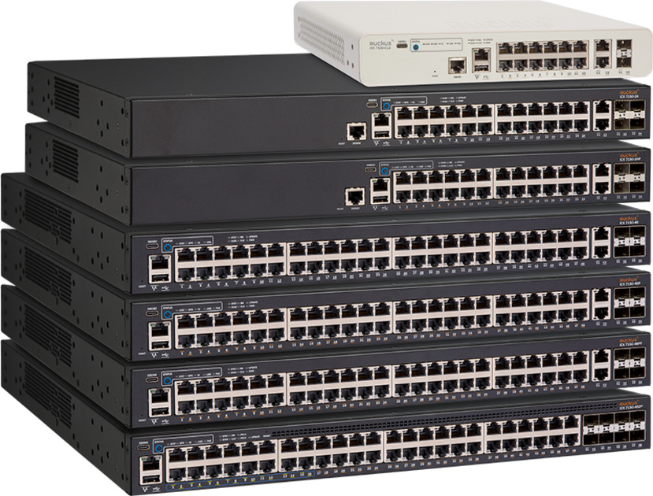
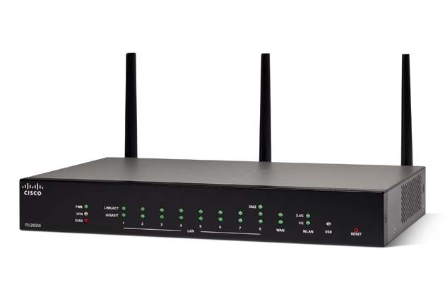
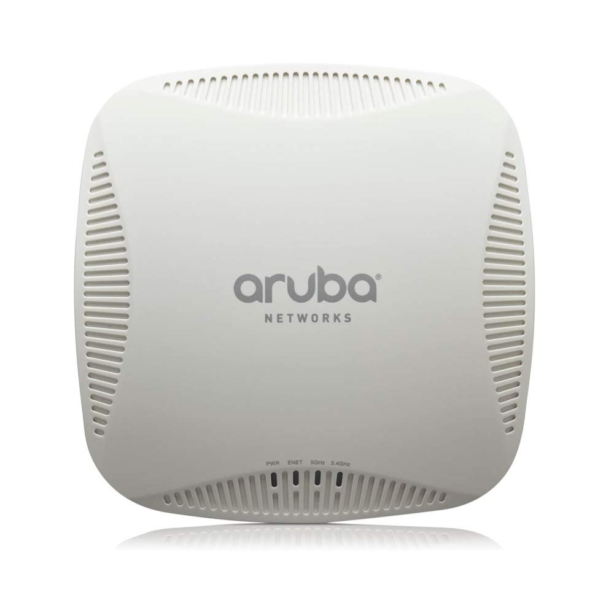

# Network devices

## switch

- Switches are very important to form a network.They can connect multiple devices such as computers, printers , wireless access points and servers which are in same building or in the campus.
- Switches comes with ports,firmware or OS.
- Unmanaged switches: Simple switches with no or fewer configuration options. Generally used in homes and small businesses.
- Managed switches: Manged switches gives more configuration options, grater security more features with greater control. In general managed switches comes with software so that most of the configurations can be done through software.Users can access switch through CLI or GUI based interfaces.

  
### l2 switch

- A Layer 2 switch works with MAC addresses only and does not care about IP address or any items of higher layers

### l3 switch

- Layer 3 switch, or multilayer switch, can do all the job of a layer 2 switch and additional static routing and dynamic routing as well. That means, a Layer 3 switch has both MAC address table and IP routing table, and handles intra-VLAN communication and packets routing between different VLANs. 
- If you need the switch to aggregate multiple access switches and do inter-VLAN routing, then a Layer 3 switch is needed

### cloud managed networking

- Enter cloud-managed networking solutions comprising of wireless access points, switches, security appliances, endpoint management, network insight, and security cameras – all managed through a dashboard.

## router

- Routers are used to different netwroks to communicate.
- Router routes data packets between computer networks.
- Routers work at the network layer (layer 3) of the Open Systems Interconnection (OSI) reference model for networking to move packets between networks using their logical addresses (which, in the case of TCP/IP, are the IP addresses of destination hosts on the network). 
- Routers contain internal tables of information called routing tables that keep track of all known network addresses and possible paths throughout the internetwork, along with the cost of reaching each network.
- Routers use microprocessors to make forwarding decisions

## wireless access points

- A wireless access point (WAP) is a hardware device or configured node on a local area network (LAN) that allows wireless capable devices and wired networks to connect through a wireless standard, including Wi-Fi or Bluetooth.
- Wireless access points are connected to routners either through wire or through wireless.

### Video Recording link

- [Networking devices](https://youtu.be/uMOm3U-gMMk)