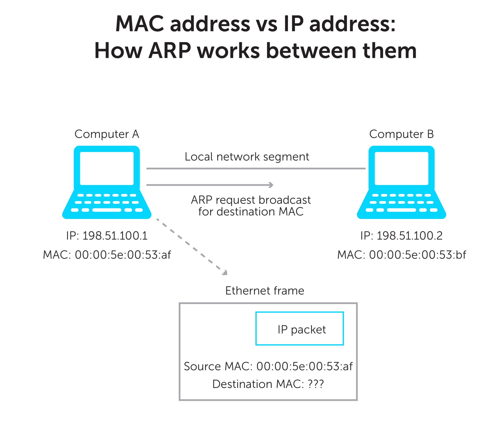

# Networking Basics

## IP address (Internet Protocol address)

- IP is a Packet-forwarding protocol.
- Each connected device uses an IP address to identify itself.
- Is a set of numbers that might look like: 198.167.55.12(IPv4) and 684D:1111:222:3333:4444:5555:6:77(IPv6)

## IPv4

- Internet protocol is a 32 bit number split into four octets separated by a .(dot);
- An IP address consists of network and host portion.
- 32bit address scheme  =  4.3 billion addresses.
- ! We are running out of addresses :)

## IPv6

- Uses a 128 bit address scheme.
- Can address 2000 devices for every square inch of our planet!.
- Provides technological changes too.Almost all IP technologies support IPv6 as well.
- IPv6 and IPv4 run alongside each other.

## Subnet

- Subnetting is the technique for logically partitioning a single physical network into multiple smaller sub-networks or subnets.
- Subnet is used to determine how many IP addresses are needed in a network.
- Subnet mask splits the IP address into host and network address, by that it defines which part of the IP address belongs to the device and which part belongs to the network.
- Subnet mask is not a IP address, it is used to mask.
- In IPv4 , like any other IP address subnet mask is also a 32 bit number.
- In that 32 bit number all host bits are 0 and network bits are 1s.
- https://www.quora.com/How-do-I-know-if-these-IP-addresses-are-in-the-same-network-How-can-I-ping-an-IP-with-a-different-subnet-mask

## DHCP

- Dynamic Host Configuration Protocol is a network management protocol.
- This is used to assign IP address to conneected devices
- When a computer is connected to the network it needs an IP address for the communication.
- DHCP automatically assigns IP address for a device as soon as it is connected to the network.For example the laptop in your house gets an ip address as soon as it establish connection to the wifi router.
- In the above scenario , the router assigns an IP address to the computer as router runs DHCP server and computer has DHCP client.DHCP Server(in router) and DCHP Client(Computer) has client-server connection.
- As soon as the devise(The computer that is connected to the netork) is out of netwrok then automatically IP address is de-assigned by the DHCP Server(in router).
- The IP address of a each device is mapped to the mac address of that device in the router configuration.
- We can assign our desired IP(adhering to the subnetting rules, that means in the same IP range) address to the device if that IP address is not already assigned to any other device then it can be set for that computer.
- Based on MAC address of the computer IP address is mapped in the router.

## MAC address

- MAC address is Media Access Control address.
- It is 48 bit unique number given to the Network Interface Card(NIC).This number is unique across the globe.
- MAC addres is permanent unlike IP address.
- In OSI model data-link layer(layer 2) implements MAC addresses.
- Packets are tranmitted from layer-2 to layer-3 or layer-3 to layer-2.That means MAC address and IP address has to work together to transmit the data in a network.
- For MAC and IP address to work togther there is a ARP protocol.Learn more in [ARP protocol](##ARP)
 section.

## ARP

- The Address Resolution Protocol (ARP) is a communication protocol used for discovering the link layer address, such as a MAC address, associated with a given internet layer address, typically an IPv4 address. This mapping is a critical function in the Internet protocol suite

- Example: Two computers in an office (Computer 1 and Computer 2) are connected to each other in a local area network by Ethernet cables and network switches, with no intervening gateways or routers. Computer 1 has a packet to send to Computer 2. Through DNS, it determines that Computer 2 has the IP address 192.168.0.55.
To send the message, it also requires Computer 2's MAC address. First, Computer 1 uses a cached ARP table to look up 192.168.0.55 for any existing records of Computer 2's MAC address (00:EB:24:B2:05:AC). If the MAC address is found, it sends an Ethernet frame containing the IP packet onto the link with the destination address 00:EB:24:B2:05:AC. If the cache did not produce a result for 192.168.0.55, Computer 1 has to send a broadcast ARP request message (destination FF:FF:FF:FF:FF:FF MAC address), which is accepted by all computers on the local network, requesting an answer for 192.168.0.55.
- The below diagram depicts how MAC and IP address work together using ARP protocol

